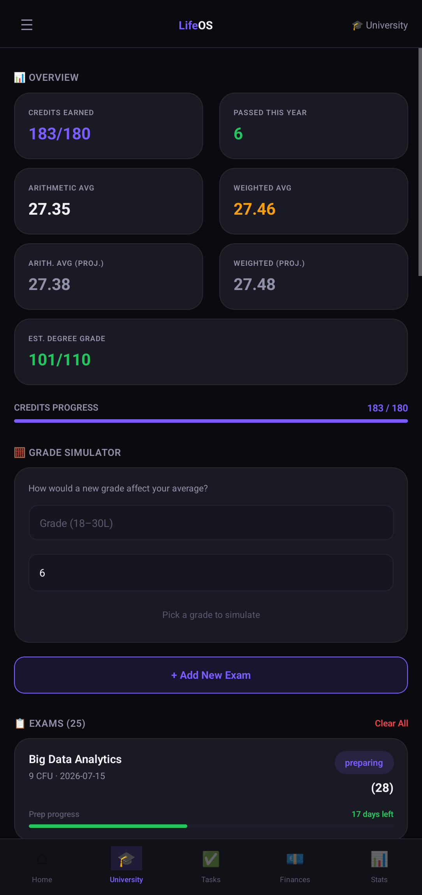
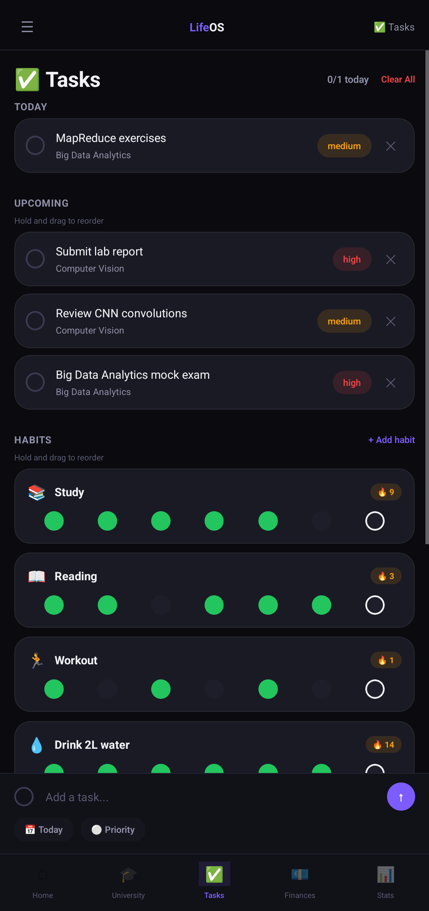
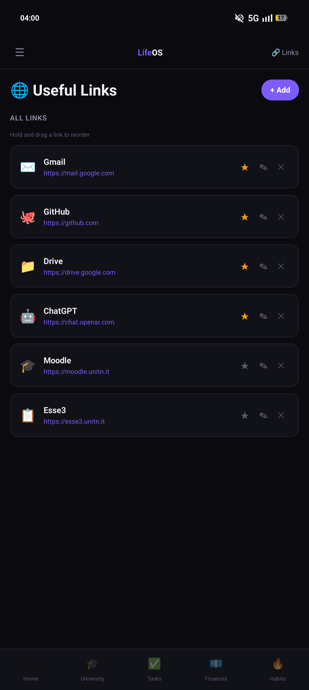
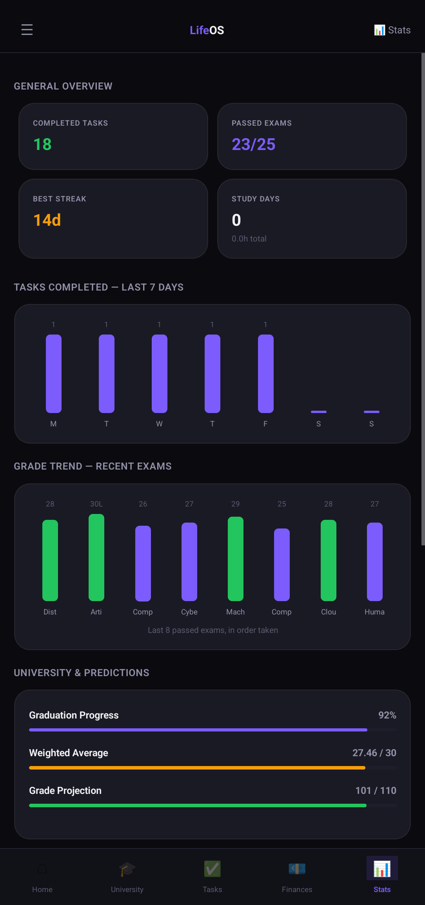
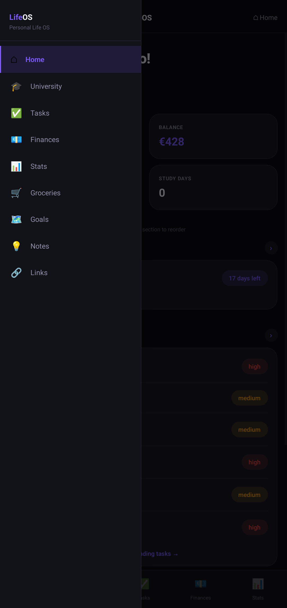

# 📱 LifeOS

[](https://reactnative.dev/)
[](https://expo.dev/)
[]()
[](LICENSE)

A personal life management app for Android. One place for university exams, finances, tasks, groceries, goals, notes, and links — everything stored locally on-device, with no account, no backend, and no subscription required.

Built out of frustration with having a different app for every life domain — one for tasks, one for finances, one for university grades — each with its own data model, notification system, and sync requirement. LifeOS consolidates everything into a single local-first app where all data is owned by the user and nothing leaves the device.

## Table of Contents

- [Preview](#preview)
- [Features](#features)
- [Known Issues](#known-issues)
- [Tech Stack](#tech-stack)
- [Architecture](#architecture)
- [Design Decisions](#design-decisions)
- [Project Structure](#project-structure)
- [Getting Started](#getting-started)
- [Usage](#usage)
- [Configuration and Environment](#configuration-and-environment)
- [Roadmap](#roadmap)
- [Changelog](#changelog)
- [Contributing](#contributing)
- [License](#license)

## Preview

|  |  |
|:--:|:--:|
| **Home Dashboard** | **University and Exams** |

|  |  |
|:--:|:--:|
| **Finance Tracker** | **Tasks** *(incl. recurring habits)* |

|  |  |
|:--:|:--:|
| **Groceries** | **Life Goals** |

|  |  |
|:--:|:--:|
| **Notes** | **Links** |

|  |  |
|:--:|:--:|
| **Statistics** | **All Screens** |

> Screenshots predate the dark "pre-Liquid Glass" visual pass introduced in v1.4. Refresh before using them for store listing assets.

## Features

### Home Dashboard

- Mission Control stat grid: tasks done/total, current balance, weighted average grade, active goals count
- Next exam countdown card
- Pending Tasks — every incomplete task across the app sorted by urgency, not capped to today
- Quick Links grid — up to 6 starred links from the Links section as tappable shortcuts
- Every section header links directly to its full screen via a navigation icon
- Section order is drag-to-reorder and persists across sessions
- First-launch tip bubbles pointing at each section, dismissable

### University and Exams

- Full exam CRUD — add, edit, and delete exams at any status (to start / preparing / passed)
- Exam form requires name, credits (3–15 CFU), and a precise date via a shared calendar picker — future dates only for upcoming exams, past dates within 5 years for passed ones
- Passed exams require an achieved grade; unpassed exams accept an optional expected grade
- Grades use an 18–30L typeahead selector — typing narrows the list (e.g. "3" returns `30` and `30L`)
- Preparing exams show a progress bar that fills as the exam date approaches
- Credits Progress bar showing CFU earned vs. the degree total set at onboarding
- Stat grid: Credits Earned, Exams Passed This Year, Arithmetic Average, Arithmetic Average with expected grades, Weighted Average, Weighted Average with expected grades — the "with expected" boxes auto-hide when no expected grade is entered
- Grade Simulator — enter a hypothetical grade and CFU to preview the effect on both averages before the exam

### Tasks

- Unified task and habit manager in a single Microsoft To Do-style screen
- Sections: Today, Upcoming, Habits, No Date
- Pinned bottom composer for quick entry without opening a modal
- Recurring habits keep a 7-day dot history and streak counter
- Edit any item via a pencil icon
- Drag-to-reorder within each section

### Finances

- Income and expense entries with date, amount, and category
- Date picker with a Today shortcut for quick entry
- Edit transactions via a pencil icon
- Overview stats: balance, total income, total expenses
- 6-month balance bar chart

### Statistics

- Task completion chart — last 7 days
- Grade trend chart — last 8 passed exams in chronological order
- University progress: graduation percentage, weighted average, degree grade projection
- Spending breakdown by category — last 30 days
- Habit streak leaderboard — top 5

### Groceries

- Checklist with category tags: supermarket, pharmacy, home, other
- Filter by all, to buy, or completed

### Goals

- Numeric progress goals with a labeled target and current-progress field
- Inline stepper and direct numeric input
- Priority levels, optional deadline via the shared date picker (5-year cap)
- Editable after creation

### Notes

- Editable title and free-text content
- Tag autocomplete: a dropdown of previously used tags appears while typing and dismisses on confirm — tags become purple chips, keyboard stays open for the next tag
- Tags are single-word and lowercase only

### Links

- Save URLs with a name and emoji icon
- Editable via a pencil icon
- Star up to 6 links to surface them on the Home Quick Links grid

### Onboarding

- First-launch flow: name, degree course, year (1–5), and total credits — selected from common Italian degree credit totals with a custom Other option
- Black splash screen with a centered logo on load

### General

- Fully in English throughout, including all displayed dates
- Every list-based screen includes a Clear All action to wipe demo data and start fresh
- Ships with realistic pre-seeded demo data across every section so the app looks used from first launch

## Known Issues

The following bugs are open and unresolved as of the most recent update:

- Drag-to-reorder on Home and in Tasks is unreliable — items sometimes deselect mid-drag and scroll speed during a drag gesture is approximately doubled
- Task completion checkbox does not always register on the first tap
- The Tasks composer does not reliably stay pinned above the on-screen keyboard while typing
- Grade Simulator grade dropdown does not commit on tap — a value can only be confirmed by typing it and pressing Enter
- Android hardware back button closes the app instead of navigating back — a direct consequence of the hand-rolled navigation (see Roadmap)
- The left-side navigation drawer can overlap the system status bar depending on the device

## Tech Stack

| Dependency | Version | Notes |
|---|---|---|
| React Native | 0.81.5 | |
| React | 19.1.0 | |
| Expo SDK | 54 | |
| expo-blur | — | iOS real blur; flat fallback on Android. Used by `GlassSheet`, `DatePicker`, and `CustomAlert` — not listed in `package.json` (see Design Decisions) |
| react-native-svg | 15.12.1 | Powers the `ProgressRing` component |
| AsyncStorage | 2.2.0 | Sole persistence layer — SQLite migration is a tracked roadmap item |
| New Architecture | — | Enabled via `newArchEnabled: true` in `app.json` |

> `package.json` lists `@react-navigation/native` and `@react-navigation/bottom-tabs`. These are installed but unused — navigation is hand-rolled via a `useState` screen switcher and a custom `Modal`/`Animated` drawer. Adopting React Navigation is a tracked roadmap item and is the planned fix for the Android back-button issue above.

## Architecture

All data lives on-device via AsyncStorage under a `lifeos_` key prefix. No backend, no authentication, no network calls at runtime.

### Screens

| Screen | Notes |
|---|---|
| `OnboardingScreen` | First-launch: name, degree, year, credit total |
| `HomeScreen` | Dashboard with reorderable sections and Quick Links |
| `UniScreen` | Exam tracker, credits bar, stat grid, Grade Simulator |
| `JournalScreen` | Unified tasks and habits — presented in the UI as Tasks |
| `FinancesScreen` | Income and expense tracking |
| `StatsScreen` | Cross-section analytics — replaces Habits in the bottom nav |
| `GroceriesScreen` | Shopping checklist |
| `GoalsScreen` | Numeric progress goals |
| `NotesScreen` | Notes with tags |
| `LinksScreen` | Bookmarks with star and reorder |

> `StudyScreen.js` and `HabitsScreen.js` exist in the codebase but are no longer reachable from navigation — the Study section and pomodoro timer were removed, and habits were merged into Tasks. Safe to delete once confirmed unused.

### Key Components

| Component | Purpose |
|---|---|
| `DraggableList` | Long-press-to-reorder via PanResponder — see Known Issues for current bugs |
| `GradeSelector` | 18–30L grade picker with typeahead — see Known Issues for tap-to-confirm bug |
| `DatePicker` | Shared calendar picker used by Exams, Finances, and Goals — enforces context-specific date constraints |
| `TagInput` | Chip input with autocomplete against existing Notes tags |
| `GlassSheet` | Bottom-sheet modal — real `BlurView` on iOS, flat panel on Android |
| `CustomAlert` | On-brand replacement for the stock Android alert dialog |
| `BarChart` | Dependency-free bar chart built from plain `View` components |

### Key Patterns

- `localDateKey(d)` — timezone-safe `YYYY-MM-DD` formatter. Avoids `toISOString()`, which converts to UTC before formatting and produces off-by-one date errors in UTC+ timezones including Italy (UTC+1/+2)
- `usePersist(key, setter)` — wraps every state setter so any update auto-saves to AsyncStorage without explicit save calls at each call site
- Shared `DatePicker` centralizes future-only, past-only, and 5-year-cap constraints in one place rather than duplicating date validation logic per screen

## Design Decisions

**Why AsyncStorage instead of SQLite?** AsyncStorage was chosen to minimize native build complexity during the prototyping phase — it requires no native module compilation, works out of the box with Expo Go, and is sufficient for the current data volume (at most a few hundred records per section). The tradeoff is a flat key-value model that makes relational queries verbose. Migrating to `expo-sqlite` is a tracked roadmap item for when the data model stabilizes.

**Why hand-rolled navigation instead of React Navigation?** The initial version was built quickly to validate the feature set before committing to an architectural pattern. A `useState` screen switcher with a custom drawer is a deliberate short-term tradeoff — it shipped faster but blocks the Android back-button fix. React Navigation adoption is planned once the Zustand migration is complete, so global state doesn't need to be threaded through a navigation context simultaneously with a persistence refactor.

**Why `expo-blur` without declaring it in `package.json`?** `expo-blur` is a transitive dependency of Expo SDK 54 and is available without explicit declaration in an Expo managed workflow. It was not added to `package.json` because Expo's managed workflow guarantees its availability — adding it explicitly could cause version conflicts on future SDK upgrades. The tradeoff is that the dependency is invisible to static analysis tools, which is worth fixing before a production release.

**Why pre-seed demo data instead of an empty state?** An empty app on first launch creates a poor first impression — every section shows a blank screen with no indication of what it will look like when used. Pre-seeded data with realistic entries communicates the value of each section immediately and lets users evaluate the app before committing to entering their own data. A Clear All action on every screen ensures the demo data is never in the way.

**Why a monolithic `App.js` for global state?** The current approach of holding all screen-level state in `App.js` was the simplest way to share data across screens without a state management library. It is also the biggest architectural liability — 11+ pieces of state in one component means every small update triggers a re-render of the entire tree. Migrating to Zustand is the first item in the Roadmap.

## Project Structure

```
LifeOS/
├── App.js                        # Root — navigation state, global state, drawer
├── app.json                      # Expo config (package: com.mylifeos.app)
├── eas.json                      # EAS Build profiles (preview APK / production AAB)
├── package.json
├── src/
│   ├── config/
│   │   ├── colors.js             # Design token palette
│   │   └── nav.js                # Screen registry and bottom-nav config
│   ├── data/
│   │   ├── helpers.js            # localDateKey, gradeWeight, calculateAverages, …
│   │   ├── seedData.js           # Pre-seeded demo data, date-relative and deterministic
│   │   └── storage.js            # loadJSON / saveJSON wrappers around AsyncStorage
│   ├── components/               # Shared UI — Card, StatCard, ProgressBar, DraggableList,
│   │                             # GradeSelector, DatePicker, TagInput, GlassSheet,
│   │                             # CustomAlert, BarChart, FadeSlideIn, …
│   └── screens/                  # One file per screen — see Architecture table above
└── images/                       # UI screenshots used in this README
```

## Getting Started

### Prerequisites

- Node.js and npm
- [Expo Go](https://expo.dev/go) version 54 or later on an Android device, or an Android emulator
- An Expo account if you intend to use EAS Build

### Installation

```bash
git clone https://github.com/mirconegri/LifeOS.git
cd LifeOS
npm install
```

> The `assets/` directory is not committed. Place your icon, splash, and adaptive icon files there before running a production build.

## Usage

### Development

```bash
npx expo start -c
```

Scan the QR code with Expo Go on Android. The `-c` flag clears the Metro cache — run with it after any dependency change or if the app hangs on first load.

### Building for internal testing

```bash
eas build --platform android --profile preview
```

Produces an installable `.apk`. The `production` profile targets an `.aab` for Play Store submission — deferred until the architecture items in the Roadmap are addressed.

## Configuration and Environment

No `.env` file and no API keys required. Configuration lives in two files:

| File | Purpose |
|---|---|
| `app.json` | Expo metadata — app name, Android package `com.mylifeos.app`, EAS project ID, `newArchEnabled` flag |
| `eas.json` | EAS Build profiles — `preview` (APK) and `production` (App Bundle) |

All user data is persisted via AsyncStorage under keys prefixed with `lifeos_`, entirely on-device.

## Roadmap

The following are explicitly planned and not yet implemented. Play Store publication is intentionally deferred until items 1–3 are addressed:

1. **Migrate global state to Zustand** — remove the 11+ state pieces from `App.js` to eliminate full-tree re-renders on every update
2. **Adopt React Navigation** (Bottom Tabs + Drawer) — replaces the hand-rolled `useState` navigator and fixes the Android back-button issue
3. **Migrate from AsyncStorage to `expo-sqlite`** — enables relational queries and a JSON export / cloud backup option
4. **Google Sign-In with cloud sync** — Firebase or Supabase under evaluation; both offer a free tier sufficient for current data volumes
5. **Home screen widgets** — quick-add expense, quick-add task, and university status at a glance without opening the app
6. **Ad banners** — once the architecture items above are stable

> The only hard cost on this list is the one-time $25 Google Play Developer registration fee. Every library and service under consideration is free at the required scale.

## Changelog

> Dates below are approximate. For precise history, see the [commit log](https://github.com/mirconegri/LifeOS/commits/main).

| Version | Date | Highlights |
|---|---|---|
| `v1.7` | Jul 2026 | Drag-to-reorder and Grade Simulator fixes (in progress); drawer safe-area padding adjustments |
| `v1.6` | Jun 2026 | Left-side drawer redesign, full English localization, per-screen Clear All action, black splash screen, Study Heatmap removed from Stats |
| `v1.5` | Jun 2026 | Pre-seeded demo data, onboarding credit/year presets with custom Other option, architecture audit — React Navigation / SQLite / cloud-sync roadmap defined |
| `v1.4` | May 2026 | Microsoft To Do-style Tasks screen, Habits merged into Tasks, Stats replaces Habits in bottom nav, dark visual redesign |
| `v1.3` | May 2026 | Goals, Links, Notes, and Habits made editable; tag autocomplete; Study section removed; drag-to-reorder rolled out app-wide |
| `v1.2` | Apr 2026 | Calendar exam dates, 18–30L grade picker, working exam Edit, Grade Simulator, shared date picker, mandatory field validation |
| `v1.1` | Apr 2026 | Exam progress bar, CFU fields, Credits Progress bar, drawer safe-area fix, Links text-visibility fix |
| `v1.0` | Apr 2026 | Onboarding flow, study timer removed, Quick Links widget on Home, custom delete dialogs, first-launch tips |

## Contributing

1. Fork the repository
2. Create a feature branch (`git checkout -b feature/your-feature`)
3. Commit your changes with a clear message
4. Open a Pull Request

For bugs or feature ideas, open an [Issue](https://github.com/mirconegri/LifeOS/issues).

### Author

**Mirco Negri** — Computer Science @ UniTrento

[](https://mirconegri.github.io/Portfolio/)
[](https://github.com/mirconegri)
[](https://www.linkedin.com/in/mirco-negri-263810225)
[](mailto:mirconegri06@gmail.com)

## License

This project is licensed under the MIT License — see the [LICENSE](LICENSE) file for details.
