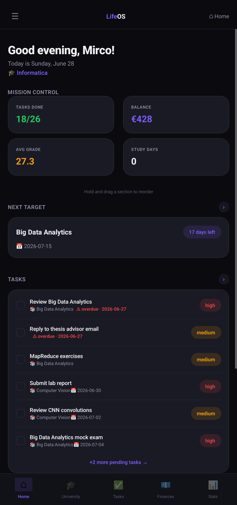
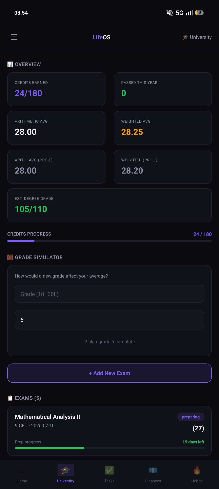
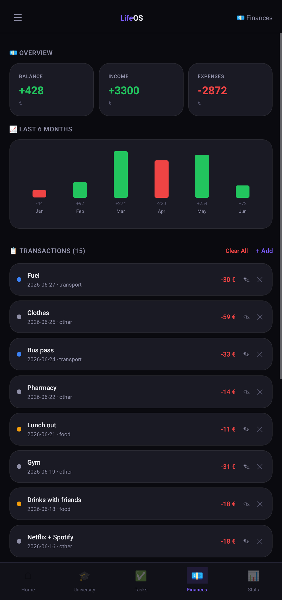
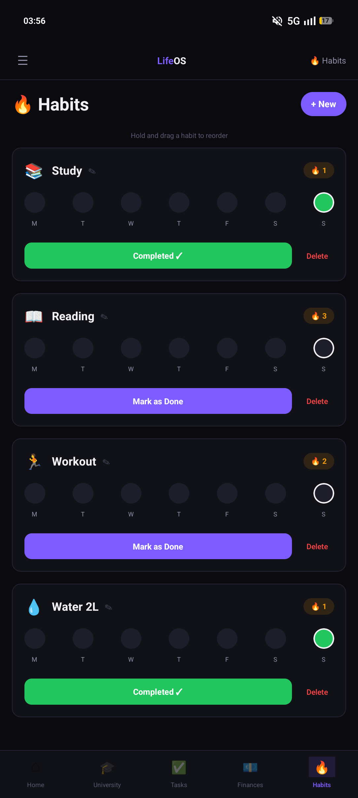
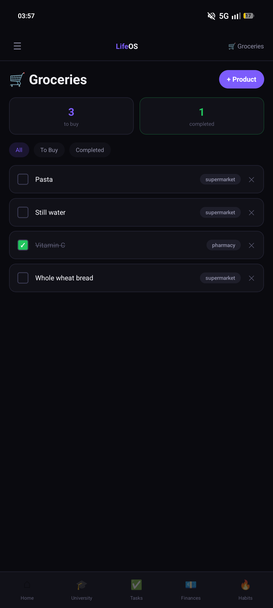
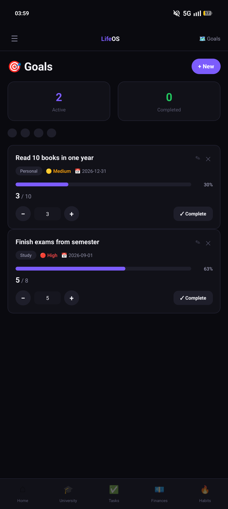
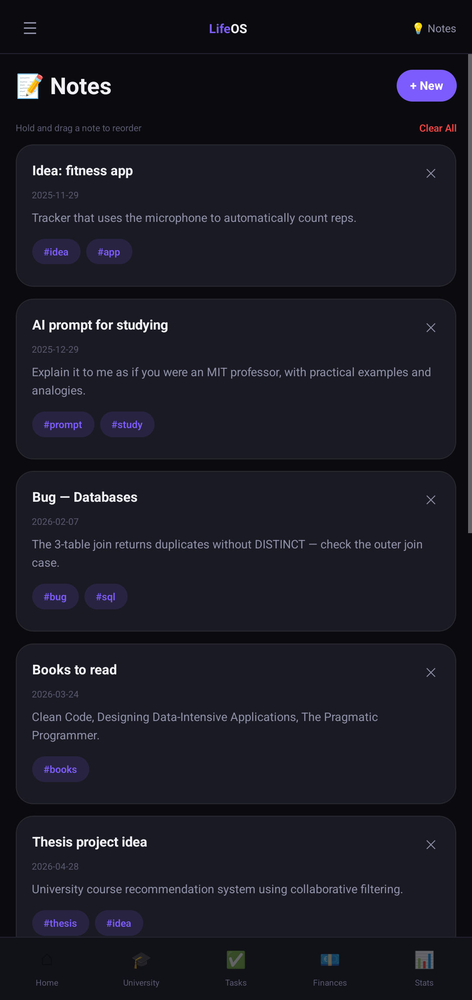

# 📱 Life OS

[](https://reactnative.dev/) [](https://expo.dev/) [](LICENSE)

I needed an application that could **centralize my entire life**—from university tracking and finances to habits and daily journaling.  
So, I created **Life OS**, a personal life operating system built with **React Native** and **Expo**.  
Designed specifically for Android with a clean, premium dark theme, it acts as the ultimate daily dashboard.

---

## 📸 Preview

Here are some screenshots of the different sections of the app:

|  |  |
|:--:|:--:|
| **Home Dashboard** | **University & Exams** |

|  |  |
|:--:|:--:|
| **Finance Tracker** | **Habits & Streaks** |

|  |  |
|:--:|:--:|
| **Groceries List** | **Life Goals** |

|  |  |
|:--:|:--:|
| **Notes & Links** | **Journal & Statistics** |

---

## 🚀 Features

- 🎓 **Uni & Study:** Track exams, grades, credits, and active study sessions.
- 💰 **Finances:** Manage income, expenses, and savings goals.
- ✅ **Habits:** Build routines with streak tracking and progress rings.
- 🛒 **Groceries:** Quick checklist for daily shopping.
- 🎯 **Goals:** Define and track short-term and long-term life objectives.
- 📝 **Notes & Links:** Save quick ideas and important web resources.
- 📖 **Journal:** A private space for daily reflections.
- 📊 **Stats:** Global view of productivity, finances, and habits.

---

## 📂 Repository Structure

```text
LifeOS/
├── README.md
├── LICENSE
├── App.js                 # Main root and navigation
├── app.json               # Expo config
├── src/
│   ├── components/        # Reusable UI components
│   ├── config/            # Colors and Navigation config
│   ├── data/              # Storage logic and Seed Data
│   └── screens/           # All 11 application screens
└── images/                # 📸 UI Screenshots
    ├── home.png
    ├── uni.png
    ├── finances.png
    ├── habits.png
    ├── groceries.png
    ├── goals.png
    ├── notes.png
    ├── journal.png
    └── stats.png
```

---

## 🛠️ Tech Stack

* **React Native** – Mobile UI framework
* **Expo (SDK 51+)** – Build system and native API access
* **AsyncStorage** – Local persistent storage for offline usage
* **JavaScript (ES6+)** – Core logic

---

## ⚙️ Installation

Clone the repository:

```bash
git clone [https://github.com/mirconegri/LifeOS.git](https://github.com/mirconegri/LifeOS.git)
cd LifeOS

```

Install dependencies:

```bash
npm install

```

Run the app using Expo:

```bash
npx expo start

```

*Use the Expo Go app on your Android/iOS device and scan the QR code to test Life OS live.*

---

### 👤 Author & Connect

**Mirco Negri** — *Computer Science Student @ UniTrento*

### 📜 License

This project is licensed under the MIT License - see the [LICENSE](https://www.google.com/search?q=LICENSE) file for details.

© 2026 Mirco Negri
# 📱 Life OS

[](https://reactnative.dev/) [](https://expo.dev/) [](LICENSE)

I needed an application that could **centralize my life**—from university tracking and finances to habits and daily journaling.  
So, I created **Life OS**, a personal life operating system built with **React Native** and **Expo**.  
Designed specifically for Android with a clean, premium dark theme, it acts as the ultimate daily dashboard.

---

## 📸 Preview

Here are some screenshots of the different sections of the app:

|  |  |
|:--:|:--:|
| **Home Dashboard** | **University & Exams** |

|  |  |
|:--:|:--:|
| **Finance Tracker** | **Habits & Streaks** |

|  |  |
|:--:|:--:|
| **Groceries List** | **Life Goals** |

|  |  |
|:--:|:--:|
| **Notes & Links** | **Journal & Statistics** |

---

## 🚀 Features

- 🎓 **Uni & Study:** Track exams, grades, credits, and active study sessions.
- 💰 **Finances:** Manage income, expenses, and savings goals.
- ✅ **Habits:** Build routines with streak tracking and progress rings.
- 🛒 **Groceries:** Quick checklist for daily shopping.
- 🎯 **Goals:** Define and track short-term and long-term life objectives.
- 📝 **Notes & Links:** Save quick ideas and important web resources.
- 📖 **Journal:** A private space for daily reflections.
- 📊 **Stats:** Global view of productivity, finances, and habits.

---

## 📂 Repository Structure

```text
LifeOS/
├── README.md
├── LICENSE
├── App.js                 # Main root and navigation
├── app.json               # Expo config
├── src/
│   ├── components/        # Reusable UI components
│   ├── config/            # Colors and Navigation config
│   ├── data/              # Storage logic and Seed Data
│   └── screens/           # All 11 application screens
└── images/                # 📸 UI Screenshots
    ├── home.png
    ├── uni.png
    ├── finances.png
    ├── habits.png
    ├── groceries.png
    ├── goals.png
    ├── notes.png
    ├── journal.png
    └── stats.png
```

---

## 🛠️ Tech Stack

* **React Native** – Mobile UI framework
* **Expo (SDK 51+)** – Build system and native API access
* **AsyncStorage** – Local persistent storage for offline usage
* **JavaScript (ES6+)** – Core logic

---

## ⚙️ Installation

Clone the repository:

```bash
git clone [https://github.com/mirconegri/LifeOS.git](https://github.com/mirconegri/LifeOS.git)
cd LifeOS

```

Install dependencies:

```bash
npm install

```

Run the app using Expo:

```bash
npx expo start

```

*Use the Expo Go app on your Android/iOS device and scan the QR code to test Life OS live.*

---

### 👤 Author & Connect

**Mirco Negri** — *Computer Science Student @ UniTrento*

### 📜 License

This project is licensed under the MIT License - see the [LICENSE](https://www.google.com/search?q=LICENSE) file for details.

© 2026 Mirco Negri
